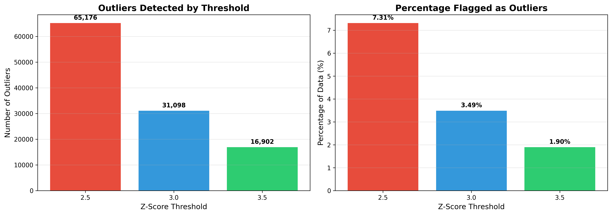
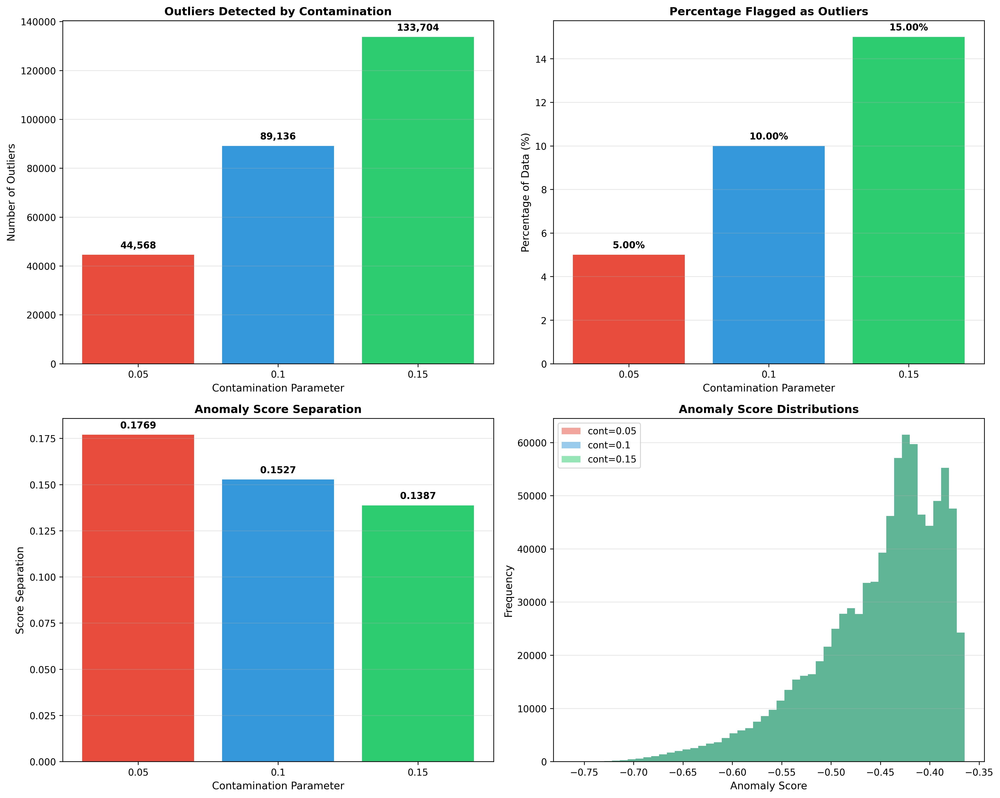
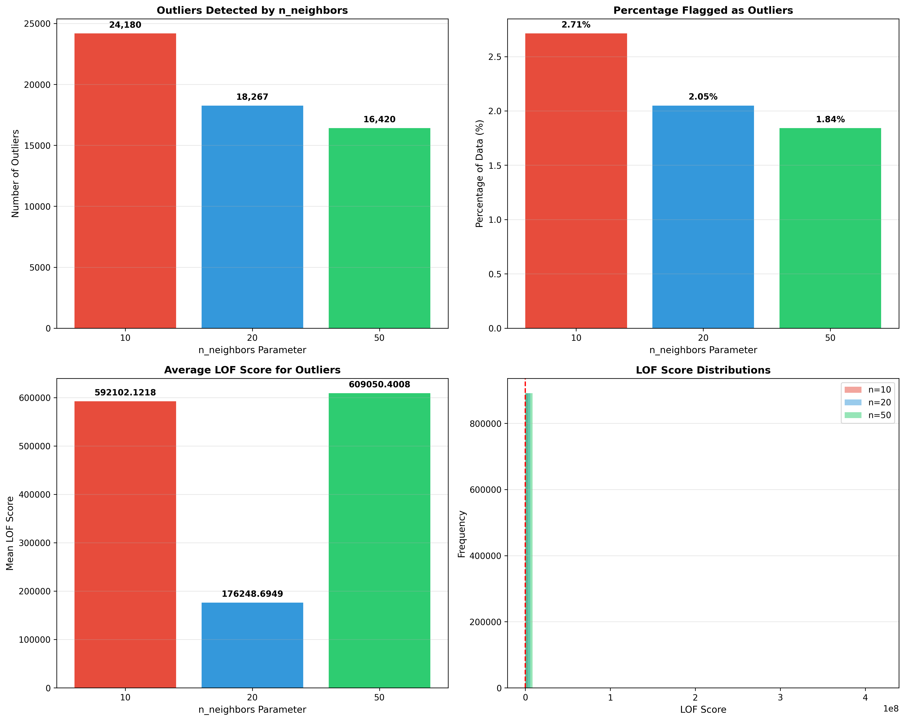
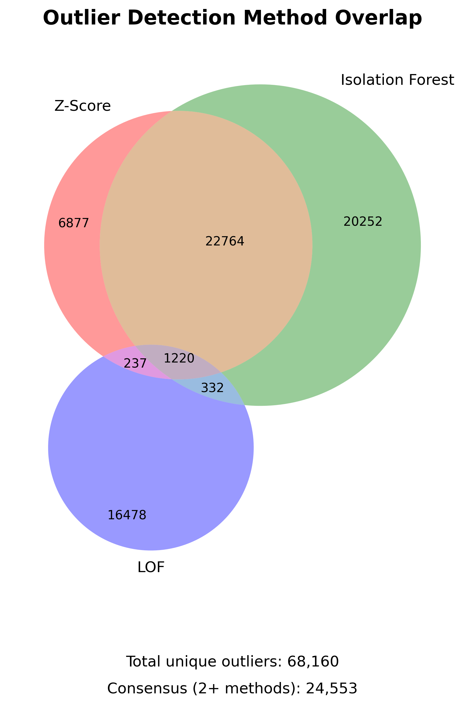
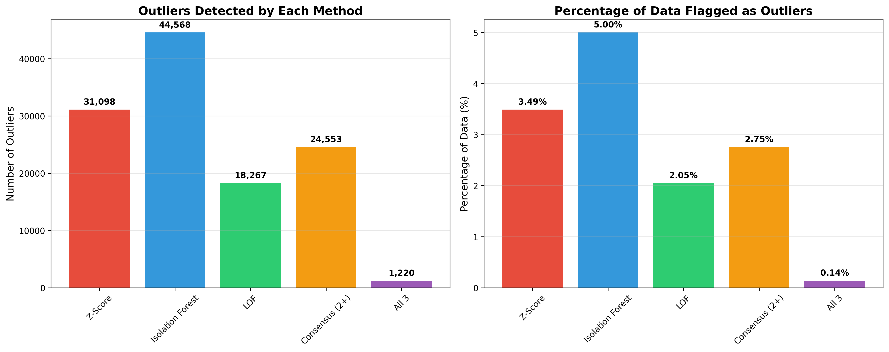
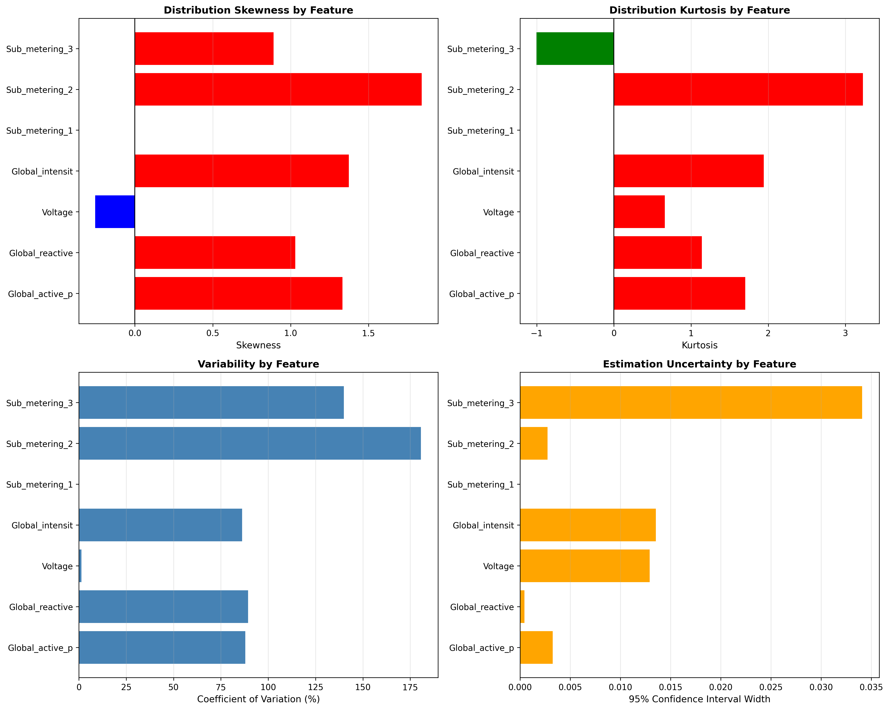
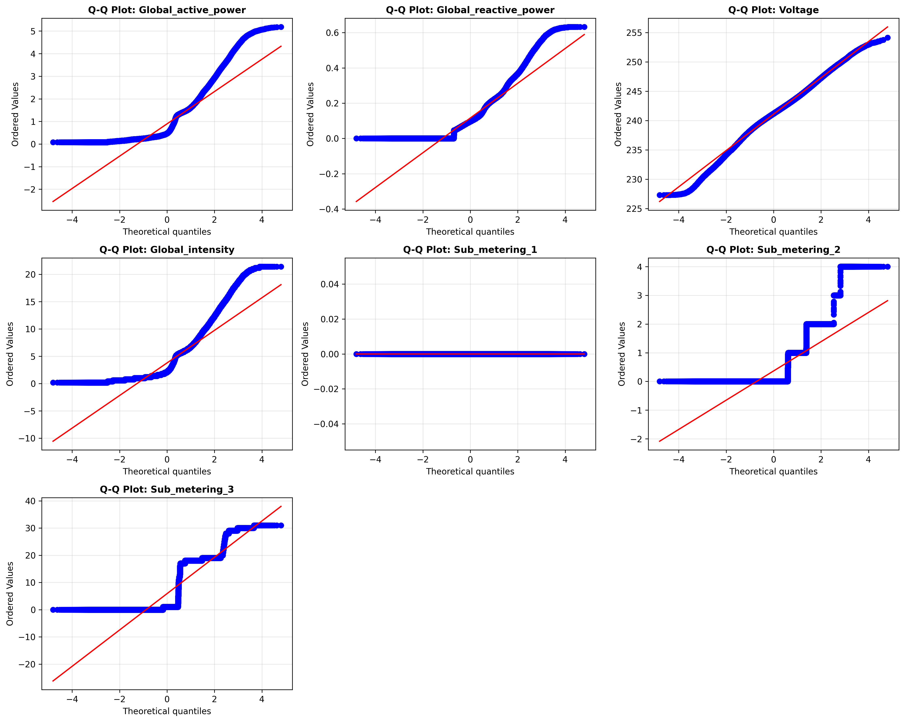
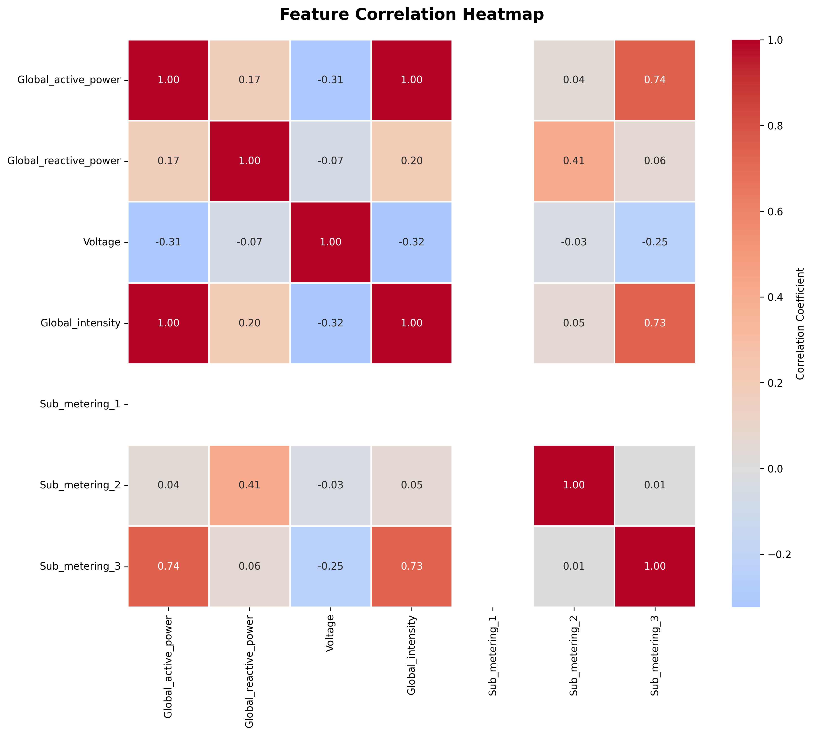
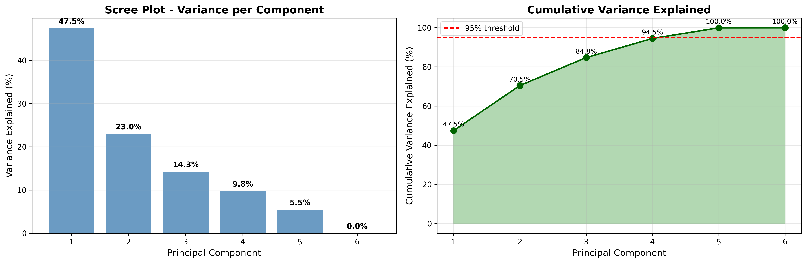
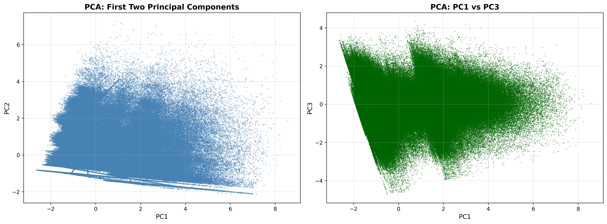

<table>
  <tr>
    <td width="150" align="center" valign="center">
      
    </td>
    <td valign="top">
      <p><strong>Universiteti i Prishtinës</strong></p>
      <p>Fakulteti i Inxhinierisë Elektrike dhe Kompjuterike</p>
      <p>Inxhinieri Kompjuterike dhe Softuerike - Programi Master</p>
      <p><strong>Projekti nga lënda:</strong> "Përgatitja dhe vizualizimi i të dhënave"</p>
      <p><strong>Profesor:</strong> PhD Mërgim Hoti</p>
      <p><strong>Studentët (Gr. 4):</strong></p>
      <ul>
        <li>Altin Morina</li>
        <li>Endri Binaku</li>
      </ul>
    </td>
  </tr>
</table>

# Konsumi Individual i Energjisë Elektrike Familjare

Analiza dhe parapërpunimi i të dhënave të konsumit të energjisë elektrike familjare.

## Të Dhënat

Ky projekt përdor datasetin **Individual Household Electric Power Consumption** nga UCI Machine Learning Repository.

- **Burimi**: [UCI ML Repository](https://archive.ics.uci.edu/ml/datasets/individual+household+electric+power+consumption)
- **Periudha**: Dhjetor 2006 - Nëntor 2010 (47 muaj)
- **Matjet**: ~2 milionë regjistrime minutë-pas-minute
- **Madhësia**: ~127 MB (txt), ~138 MB (csv)

### Variablat Origjinale

| Variabli | Përshkrimi | Njësia |
|----------|------------|--------|
| Date | Data në formatin dd/mm/yyyy | - |
| Time | Koha në formatin hh:mm:ss | - |
| Global_active_power | Fuqia aktive globale mesatare për minutë | kilovat |
| Global_reactive_power | Fuqia reaktive globale mesatare për minutë | kilovat |
| Voltage | Tensioni mesatar për minutë | volt |
| Global_intensity | Intensiteti global i rrymës mesatare për minutë | amper |
| Sub_metering_1 | Nën-matësi i energjisë Nr. 1 (kuzhinë) | vat-orë |
| Sub_metering_2 | Nën-matësi i energjisë Nr. 2 (lavanderi) | vat-orë |
| Sub_metering_3 | Nën-matësi i energjisë Nr. 3 (kontrolli i klimës) | vat-orë |

**Shënim**: Vlerat që mungojnë janë të koduara si `?`.

## Struktura e Projektit

Ky projekt është i ndarë në dy faza:

- **Faza 1 (E Përfunduar)**: Parapërpunimi i të dhënave, pastrimi, inxhinieria e tipareve, transformimi dhe selektimi i tipareve
- **Faza 2 (E Përfunduar)**: Detektimi i avancuar i vlerave të jashtëzakonshme (outliers), analiza e fals-pozitivëve/negativëve dhe eksplorimi shumëvariatesh

## Konfigurimi

### Kërkesat

- Python 3.7+
- pandas
- numpy
- scikit-learn (për Fazën 2)

Instaloni varësitë:
```bash
pip install pandas numpy scikit-learn
```

### Marrja e Datasetit

1. Shkarkoni datasetin nga [UCI ML Repository](https://archive.ics.uci.edu/ml/datasets/individual+household+electric+power+consumption)
2. Ekstraktoni `household_power_consumption.txt` në direktorinë `data/raw/`
3. Filet e datasetit janë të përjashtuar nga git (shiko `.gitignore`)

## Faza 1: Parapërpunimi i Të Dhënave - Evolucioni i Kolonave

Ky seksion dokumenton se si kanë ndryshuar kolonat e datasetit përmes çdo hapi të parapërpunimit.

### Hapi 1: Kampionimi
**Skripta**: `src/preprocessing/create_stratified_sample.py`

**Hyrja**: `data/raw/household_power_consumption.txt` (2,075,259 rreshta × 9 kolona)
**Dalja**: `data/raw/household_power_consumption_sample.txt` (999,970 rreshta × 9 kolona)

**Kolonat**: Asnjë ndryshim
- Date, Time, Global_active_power, Global_reactive_power, Voltage, Global_intensity, Sub_metering_1, Sub_metering_2, Sub_metering_3

**Rezultati**: 48.2% e të dhënave origjinale (kampionim i shtresëzuar)

---

### Hapi 2: Eksplorimi i Të Dhënave
**Skripta**: `src/preprocessing/data_exploration.py`

**Hyrja**: `data/raw/household_power_consumption_sample.txt` (999,970 rreshta × 9 kolona)
**Dalja**: Vetëm raporte (analizë vetëm për lexim)

**Kolonat**: Asnjë ndryshim në dataset
**Files Dalës**:
- `reports/analysis/exploration_report.txt`
- `reports/analysis/exploration_statistics.csv`
- `reports/analysis/exploration_sample.csv`

**Analiza**: Tipet e të dhënave, statistikat përmbledhëse, rangjet e vlerave, analiza e periudhës kohore

---

### Hapi 3: Analiza e Cilësisë së Të Dhënave
**Skripta**: `src/preprocessing/data_quality_analysis.py`

**Hyrja**: `data/raw/household_power_consumption_sample.txt` (999,970 rreshta × 9 kolona)
**Dalja**: Vetëm raporte (analizë vetëm për lexim)

**Kolonat**: Asnjë ndryshim në dataset
**Files Dalës**:
- `reports/quality/quality_report.txt`
- `reports/quality/quality_missing_values.csv`
- `reports/quality/quality_outliers.csv`

**Gjetjet**:
- Vlera që mungojnë: 87,731 (0.97%) - të gjitha 7 kolonat numerike të prekura njëkohësisht
- Dublikate: 0
- Outliers të detektuar: 256,973 (25.7% duke përdorur metodën IQR me 1.5×IQR)

---

### Hapi 4: Pastrimi i Të Dhënave
**Skripta**: `src/preprocessing/data_cleaning.py`

**Hyrja**: `data/raw/household_power_consumption_sample.txt` (999,970 rreshta × 9 kolona)
**Dalja**: `data/processed/household_power_consumption_cleaned.csv` (891,357 rreshta × 10 kolona)

**Ndryshimet në Kolona**:
- **Shtuar**: `DateTime` (datetime) - Integrimi i kolonave Date dhe Time
- **Larguar**: Asnjë (kolonat Date dhe Time u mbajtën)
- **Modifikuar**: Të gjitha kolonat numerike (vlerat që mungojnë u mbushën përmes interpolimit kohor)

**Operacionet**:
1. U krijua kolona `DateTime` nga Date + Time
2. U mbushën 87,731 vlera që mungojnë duke përdorur interpolimin linear (bazuar në kohë)
3. U larguan 108,613 rreshta outlier (10.86%) duke përdorur metodën IQR (pragu 3×IQR)
4. U kufizuan vlerat negative në 0

**Kolonat Përfundimtare** (10):
- DateTime, Date, Time
- Global_active_power, Global_reactive_power, Voltage, Global_intensity
- Sub_metering_1, Sub_metering_2, Sub_metering_3

**Files Dalës**:
- `data/processed/household_power_consumption_cleaned.csv`
- `reports/quality/cleaning_report.txt`

---

### Hapi 5: Inxhinieria e Tipareve
**Skripta**: `src/preprocessing/feature_engineering.py`

**Hyrja**: `data/processed/household_power_consumption_cleaned.csv` (891,357 rreshta × 10 kolona)
**Dalja**: `data/processed/household_power_consumption_with_features.csv` (891,357 rreshta × 34 kolona)

**Ndryshimet në Kolona**:
- **Shtuar**: 24 tipare të reja
- **Larguar**: Asnjë

**Tiparet e Reja sipas Kategorisë**:

1. **Tipare Kohore** (9 kolona):
   - `Year` (int) - Viti nga DateTime
   - `Month` (int) - Muaji (1-12)
   - `Day` (int) - Dita e muajit
   - `Hour` (int) - Ora (0-23)
   - `Minute` (int) - Minuta (0-59)
   - `DayOfWeek` (int) - Dita e javës (0=E Hënë, 6=E Diel)
   - `DayName` (str) - Emri i ditës (Monday-Sunday)
   - `MonthName` (str) - Emri i muajit (January-December)
   - `WeekOfYear` (int) - Numri i javës (1-53)

2. **Tipare Binare** (5 kolona):
   - `IsWeekend` (int) - 1 nëse E Shtunë/E Diel, 0 ndryshe
   - `IsNight` (int) - 1 nëse ora 22-5, 0 ndryshe
   - `IsMorning` (int) - 1 nëse ora 6-11, 0 ndryshe
   - `IsAfternoon` (int) - 1 nëse ora 12-17, 0 ndryshe
   - `IsEvening` (int) - 1 nëse ora 18-21, 0 ndryshe

3. **Tipare Kategorike** (2 kolona):
   - `Season` (str) - Winter/Spring/Summer/Autumn
   - `TimeOfDay` (str) - Morning/Afternoon/Evening/Night

4. **Tipare të Llogaritura** (4 kolona):
   - `Sub_metering_4` (float) - Energjia e pamatshme (Global_active_power × 1000/60 - shuma e Sub_metering_1,2,3)
   - `Total_Sub_metering` (float) - Shuma e të gjitha vlerave të nën-matësve
   - `Energy_per_minute` (float) - Global_active_power / 60 (kWh për minutë)
   - `Intensity_ratio` (float) - Global_intensity / (Voltage / 1000)

5. **Tipare Statistikore** (4 kolona):
   - `Power_1h_avg` (float) - Mesatarja e lëvizshme e Global_active_power (dritare 60 minuta)
   - `Power_24h_avg` (float) - Mesatarja e lëvizshme e Global_active_power (dritare 1440 minuta)
   - `Power_prev_1h` (float) - Tipar i vonesës: Global_active_power nga 1 orë më parë
   - `Power_change_1h` (float) - Ndryshimi në fuqi nga ora e kaluar

**Files Dalës**:
- `data/processed/household_power_consumption_with_features.csv`
- `reports/analysis/features_report.txt`

---

### Hapi 6: Agregimi i Të Dhënave
**Skripta**: `src/preprocessing/data_aggregation.py`

**Hyrja**: `data/processed/household_power_consumption_with_features.csv` (891,357 rreshta × 34 kolona)
**Dalja**: 7 dataset-e të agreguara (skedarë të veçantë)

**Ndryshimet në Kolona**: Krijon pamje të agreguara të veçanta (dataseti origjinal i pandryshuar)

**Files Dalës**:
- `data/aggregated/aggregation_*.csv` (7 skedarë)
- `reports/analysis/aggregation_report.txt`

---

### Hapi 7: Transformimi i Të Dhënave
**Skripta**: `src/preprocessing/data_transformation.py`

**Hyrja**: `data/processed/household_power_consumption_with_features.csv` (891,357 rreshta × 34 kolona)
**Dalja**: `data/processed/household_power_consumption_transformed.csv` (891,357 rreshta × 40 kolona)

**Ndryshimet në Kolona**:
- **Shtuar**: 6 tipare të reja të transformuara
- **Larguar**: Asnjë

**Tiparet e Reja të Transformuara**:

1. **Diskretizimi** (2 kolona):
   - `Power_Level` (category) - 4 nivele: Low, Medium, High, Very High
   - `Voltage_Level` (category) - 5 nivele: Very Low, Low, Normal, High, Very High

2. **Binarizimi** (2 kolona):
   - `Is_High_Power` (int) - 1 nëse Global_active_power > mesataren, 0 ndryshe
   - `Voltage_Normal_Binary` (int) - 1 nëse Voltage mes 235-245V, 0 ndryshe

3. **Label Encoding** (2 kolona):
   - `Season_Encoded` (int) - 0=Winter, 1=Spring, 2=Summer, 3=Autumn
   - `TimeOfDay_Encoded` (int) - 0=Night, 1=Morning, 2=Afternoon, 3=Evening

**Files Dalës**:
- `data/processed/household_power_consumption_transformed.csv`
- `reports/analysis/transformation_report.txt`

---

### Hapi 8: Selektimi i Tipareve
**Skripta**: `src/preprocessing/feature_selection.py`

**Hyrja**: `data/processed/household_power_consumption_transformed.csv` (891,357 rreshta × 40 kolona)
**Dalja**: `data/processed/household_power_consumption_final.csv` (891,357 rreshta × 33 kolona)

**Ndryshimet në Kolona**:
- **Larguar**: 8 tipare të tepërta (korrelacion i lartë, |r| > 0.7)
- **Mbajtur**: 33 tipare

**Tiparet e Larguara** (8):
1. `Global_intensity`
2. `Intensity_ratio`
3. `IsEvening`
4. `Is_High_Power`
5. `Sub_metering_3`
6. `Sub_metering_4`
7. `TimeOfDay_Encoded`
8. `Total_Sub_metering`

**Kolonat Përfundimtare** (33):
- **DateTime & Time**: DateTime, Date, Time
- **Original Power**: Global_active_power, Global_reactive_power, Voltage
- **Sub-metering**: Sub_metering_1, Sub_metering_2, Sub_metering_3, Sub_metering_4
- **Temporal**: Year, Month, Day, Hour, DayOfWeek, IsWeekend
- **Categorical**: Season, TimeOfDay
- **Discretized**: Power_Level, Voltage_Level
- **Binary**: Voltage_Normal_Binary, IsNight, IsMorning, IsAfternoon
- **Encoded**: Season_Encoded
- **Calculated**: Energy_per_minute
- **Statistical**: Power_1h_avg, Power_24h_avg, Power_prev_1h, Power_change_1h

**Files Dalës**:
- `data/processed/household_power_consumption_final.csv`
- `outputs/correlation_matrix.csv`
- `reports/analysis/feature_selection_report.txt`

---

## Përmbledhja e Fazës 1

### Evolucioni i Datasetit

| Hapi | Rreshtat | Kolonat | Ndryshimet Kryesore |
|------|----------|---------|---------------------|
| **Origjinali** | 2,075,259 | 9 | Të dhëna të papërpunuara me vlera që mungojnë |
| **Pas Kampionimit** | 999,970 | 9 | Kampion i shtresëzuar (48.2%) |
| **Pas Pastrimit** | 891,357 | 10 | +DateTime, -108K outliers, vlerat e munguara u rregulluan |
| **Pas Inxhinierisë** | 891,357 | 34 | +24 tipare të reja |
| **Pas Transformimit** | 891,357 | 40 | +6 tipare të transformuara |
| **Përfundimtar** | 891,357 | 33 | -7 tipare të tepërta |

---

## Faza 2: Detektimi i Avancuar i Vlerave të Jashtëzakonshme dhe Analiza Shumëvariatesh

**Statusi**: ✅ E Përfunduar  
**Dataseti Hyrës**: `data/processed/household_power_consumption_cleaned.csv` (891,357 rreshta × 10 kolona)  
**Objektivi**: Detektimi i anomalive duke përdorur metoda të shumëfishta (Z-Score, Isolation Forest, LOF) dhe kryerja e analizës shumëvariatesh për të kuptuar strukturën e të dhënave.

---

### Hapi 9: Detektimi i Outliers me Z-Score
**Skripta**: `src/analysis/outlier_zscore.py`

**Të Dhënat Hyrëse**: 
- 7 tipare numerike (Global_active_power, Global_reactive_power, Voltage, Global_intensity, Sub_metering_1, 2, 3).
- Shpërndarja e të dhënave është e anuar djathtas (right-skewed).

**Procesi**: 
- Llogaritja e Z-scores për secilin tipar ($Z = \frac{x - \mu}{\sigma}$).
- Eksperimentimi me pragun $\sigma = 2.5, 3.0, 3.5$.
- U zgjodh **pragu 3.0** bazuar në rregullin statistikor 99.7%.

**Rezultatet**:
- **31,098 outliers të detektuar** (3.49% e të dhënave).
- U gjeneruan flamuj boolean në `outliers_zscore_flags.csv`.

**Vizualizimi**:  


---

### Hapi 10: Detektimi i Outliers me Isolation Forest
**Skripta**: `src/analysis/outlier_isolation_forest.py`

**Të Dhënat Hyrëse**: 
- Të njëjtat 7 tipare numerike.
- Analiza kërkon trajtimin e shpërndarjeve jo-normale dhe marrëdhënieve shumëvariatesh.

**Procesi**: 
- Aplikimi i Isolation Forest (metodë e ensemble learning).
- Testimi i parametrave të 'contamination': $0.05, 0.10, 0.15$.
- U zgjodh **contamination = 0.05** për shkak të ndarjes më të mirë të pikëve të anomalisë (0.1769).

**Rezultatet**:
- **44,568 outliers të detektuar** (5.00% e të dhënave).
- U detektuan 13,470 outliers unikë që Z-Score nuk i kapi (shable komplekse shumëvariatesh).

**Vizualizimi**:  


---

### Hapi 11: LOF (Local Outlier Factor)
**Skripta**: `src/analysis/outlier_lof.py`

**Të Dhënat Hyrëse**: 
- Fokus në variacionet e densitetit lokal në vend të ekstremeve globale.
- Hap intensiv kompjuterik që kërkon parametra të optimizuar.

**Procesi**: 
- Aplikimi i LOF për të detektuar anomali të bazuara në densitet.
- Testimi i fqinjëve $k = 10, 20, 50$.
- U zgjodh **$k=20$** si parametri i balancuar për kontekstin lokal.

**Rezultatet**:
- **18,267 outliers të detektuar** (2.05% e të dhënave).
- Shënon pikat në rajone lokale të rralla që metodat e tjera i humbasin.

**Vizualizimi**:  


---

### Hapi 12: Krahasimi i Metodave & Konsensusi
**Skripta**: `src/analysis/outlier_comparison.py`

**Të Dhënat Hyrëse**: 
- Flamujt e outliers nga hapat Z-Score, Isolation Forest, dhe LOF.

**Procesi**: 
- Krijimi i një diagrami Venn për të vizualizuar mbivendosjen.
- Llogaritja e pikëve të konsensusit (sa metoda pajtohen për një pikë).

**Rezultatet**:
- **1,220 outliers me besueshmëri të lartë** të detektuar nga TË 3 metodat (0.14%).
- **24,553 outliers konsensusi** të detektuar nga 2+ metoda (2.75%).
- Ofron një set robust të outliers për shënjim.

**Vizualizimet**:  
  


---

### Hapi 13: Analiza e Avancuar Statistikore
**Skripta**: `src/analysis/enhanced_statistics.py`

**Hyrja**: 
- Dataseti i pastruar (891,357 rreshta).

**Procesi**: 
- Llogaritja e Skewness, Kurtosis, Variancës, dhe Intervaleve të Besimit (95%).
- Analiza e perqindëshve (percentiles) të 5-të, 25-të, 75-të, dhe 95-të.

**Rezultatet**:
- Konfirmoi që të gjitha tiparet janë **të anuara djathtas** (Positive Skewness).
- Konfirmoi **bishta të rëndë** (Positive Kurtosis), duke validuar prezencën e outliers.

**Vizualizimi**:  


---

### Hapi 14: Analiza e Shpërndarjes & Testet e Normalitetit
**Skripta**: `src/analysis/distribution_analysis.py`

**Hyrja**: 
- Shpërndarjet e tipareve kërkojnë testim formal të normalitetit për të validuar supozimet e metodave.

**Procesi**: 
- Kryerja e testeve **Shapiro-Wilk** dhe **Kolmogorov-Smirnov**.
- Gjenerimi i grafikëve Q-Q dhe KDE (Kernel Density Estimation).

**Rezultatet**:
- **Vetëm 1 nga 7 tipare** kaloi testin e normalitetit.
- Validon përdorimin e Isolation Forest dhe LOF (që nuk supozojnë normalitet) ndaj metodave thjesht parametrike.

**Vizualizimi**:  


---

### Hapi 15: Analiza e Korrelacionit
**Skripta**: `src/analysis/correlation_analysis.py`

**Hyrja**: 
- 7 tipare numerike me redundancë potenciale.

**Procesi**: 
- Llogaritja e Matricës së Korrelacionit Pearson.
- Identifikimi i korrelacioneve të forta ($|r| \ge 0.7$).

**Rezultatet**:
- U gjet **korrelacion 0.999** mes `Global_active_power` dhe `Global_intensity` (Konsistente matematikisht).
- U identifikua redundanca duke justifikuar reduktimin e dimensionalitetit.

**Vizualizimi**:  


---

### Hapi 16: Analiza e Komponentëve Kryesorë (PCA)
**Skripta**: `src/analysis/pca_analysis.py`

**Hyrja**: 
- Të dhëna me dimensionalitet të lartë (7 tipare) me redundancë të konfirmuar.

**Procesi**: 
- Standardizimi i të dhënave (Mesatarja=0, Devijimi Std=1).
- Aplikimi i PCA për të projektuar të dhënat në hapësirë me dimensione më të ulëta.
- Analiza e Raportit të Variancës së Shpjeguar.

**Rezultatet**:
- **PC1 (47%) + PC2 (23%)** shpjegojnë **70% të variancës totale**.
- U reduktuan 7 dimensione në 2 për vizualizim me humbje minimale të informacionit.

**Vizualizimet**:  
  


---

### Hapi 17: Eliminimi i Outliers
**Skripta**: `src/analysis/remove_outliers.py`

**Arsyetimi**: 
- Siç kërkohet nga "Mënjanimi i zbulimeve jo të sakta", ne kemi eliminuar vetëm outliers ku të paktën 2 nga 3 metodat kanë rënë dakord (Konsensusi).
- Kjo siguron që po largojmë vetëm anomalitë e vërteta dhe jo variacionet normale të të dhënave.

**Procesi**: 
- Hyrja: Rezultatet e konsensusit nga Hapi 12.
- Filtrimi: Largimi i rreshtave ku `outlier_consensus == True`.

**Rezultatet**:
- **24,553 outliers u eliminuan** (2.75% e datasetit).
- Dataseti u pastrua nga 891,357 në **866,804 rreshta**.
- Krijuar dataseti final i pastër për Fazën 3 (Vizualizimi).

**Folderat Dalës**:
- `data/processed/household_power_consumption_phase2_clean.csv`
- `reports/phase2/outlier_removal_report.txt`

---

## Ekzekutimi i Projektit

### Udhëzuesi i Plotë i Ekzekutimit

Për udhëzime të detajuara hap-pas-hapi se si të ekzekutoni këtë projekt të plotë nga fillimi në fund, ju lutemi referojuni:

**[EXECUTION_GUIDE.md](EXECUTION_GUIDE.md)**

### Fillimi i Shpejtë

Për të ekzekutuar tubacionin e plotë të përpunimit të të dhënave:

1. **Parakushtet:**
   ```bash
   pip install pandas numpy scikit-learn
   ```

2. **Navigoni te direktoria preprocessing (për Fazën 1) ose analysis (për Fazën 2):**
   ```bash
   cd src/preprocessing
   ```

3. **Ekzekutoni skriptat sipas radhës (Faza 1):**
   ```bash
   python create_stratified_sample.py
   python data_exploration.py
   python data_quality_analysis.py
   python data_cleaning.py
   python feature_engineering.py
   python data_aggregation.py
   python data_transformation.py
   python feature_selection.py
   ```

4. **Ekzekutoni skriptat sipas radhës (Faza 2):**
   ```bash
   cd ../analysis
   python outlier_zscore.py
   python outlier_isolation_forest.py
   python outlier_lof.py
   python outlier_comparison.py
   python enhanced_statistics.py
   python distribution_analysis.py
   python correlation_analysis.py
   python pca_analysis.py
   ```

## Struktura e Folderave/files

```
│
├── src/preprocessing/          ← Skriptat e Fazës 1
├── src/analysis/               ← Skriptat e Fazës 2
├── data/
│   ├── raw/                    ← Dataseti origjinal & kampioni
│   ├── processed/              ← Të pastruara, me tipare, finale
│   └── aggregated/             ← 7 agregime
│
├── reports/
│   ├── analysis/               ← Raportet e Fazës 1
│   ├── phase2/                 ← Raportet e Fazës 2
│   └── quality/                ← Raportet e cilësisë
│
├── outputs/                    ← Matricat, grafikët, vizualizimet
└── docs/                       ← README, udhëzuesit
```

## Përmbledhje e Pipeline-it të Përgatitjes së Të Dhënave

| Hapi | Input | Output Dataset | Rreshta | Kolona | Transformimi Kryesor |
|------|-------|----------------|---------|--------|----------------------|
| **0. Burimet** | `household_power_consumption.txt` | - | 2,075,259 | 9 | Të dhëna bruto me vlera `?` |
| **1. Kampionimi** | Raw Data | `..._sample.txt` | 999,970 | 9 | 48% Stratified Sample |
| **4. Pastrimi** | Sample | `..._cleaned.csv` | 891,357 | 10 | Imputim linear, -108k outliers (IQR), +DateTime |
| **5. Inxhinieria** | Cleaned | `..._with_features.csv` | 891,357 | 34 | +24 tipare (kohore, statistikore, logjike) |
| **7. Transformimi** | Featured | `..._transformed.csv` | 891,357 | 40 | +6 tipare (diskretizim, binarizim, encoding) |
| **8. Selektimi** | Transformed | `..._final.csv` (Faza 1) | 891,357 | 33 | -7 tipare redundante/korrelacion i lartë |
| **17. Outliers** | Final (F1) | `..._phase2_clean.csv` (Faza 2) | **866,804** | 33 | **-24,553 konsensus outliers** (2+ metoda) |

## Citimi

Dua, D. and Graff, C. (2019). UCI Machine Learning Repository [http://archive.ics.uci.edu/ml]. Irvine, CA: University of California, School of Information and Computer Science.
